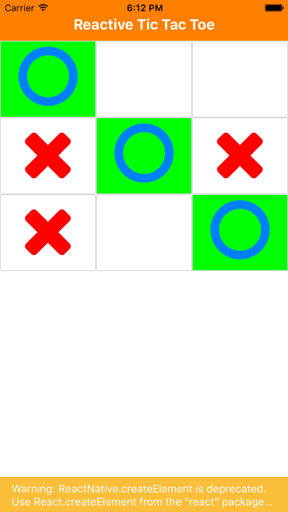
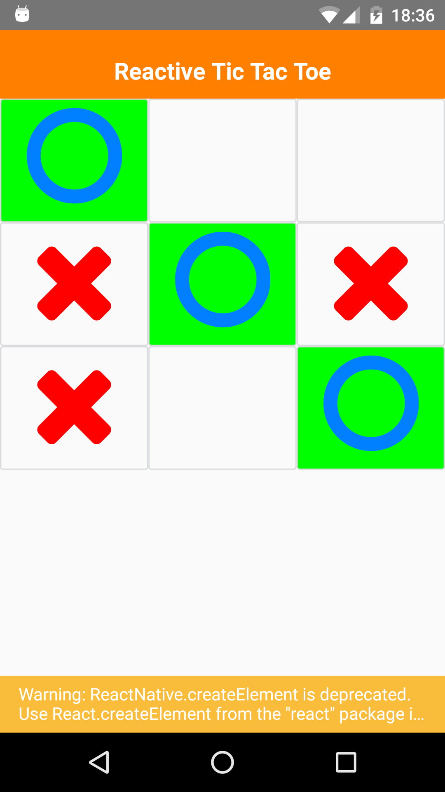

# Reactive TicTacToe
This is a simple prototype to learn react-native.

## Screenshots
### iOS

### Android

## Dependencies
- [react-native-vector-icons](https://github.com/oblador/react-native-vector-icons)
- [rnpm](https://github.com/rnpm/rnpm)

# LICENSE
The MIT License (MIT)

Copyright (c) 2016 Niclas Mietz
